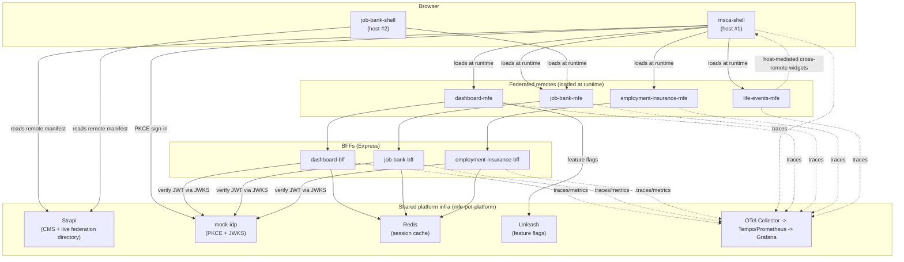

# mfe-pot — Architecture

> **Scope note**: this is an independent proof-of-technology exercise, not
> affiliated with, endorsed by, or associated with Service Canada, ESDC, or
> the Government of Canada. "MSCA" and GC design-system references exist
> only to ground the architecture in a realistic scenario.

This is the **living, non-dated architecture reference for the whole
7-repo family** — what exists today, how the pieces fit together, and how
a request actually flows through the system. It's meant to be the first
thing a new reader (human or Claude) opens to get oriented, before going
deeper. Three other docs cover adjacent ground on purpose, not by
duplication:

- **`mfe-pot-platform/CLAUDE.md`** — the durable *rationale* reference:
  every non-obvious gotcha, the reasoning behind each decision, and the
  fine detail (federation-sharing policy, security model, i18n mechanism,
  Helm/Docker shape). Read this before making an architectural change;
  this doc is the map, that one is the terrain.
- **`docs/plans/`** — dated, point-in-time design docs (the original
  design, individual migrations). History, not living reference.
- **`docs/poc-writeup.md`** — the retrospective: what was built, why, what
  it proved, what it cost to learn. Narrative, not reference.

## System at a glance

**7 independent repos**, none of them git submodules, tied together only
by this meta repo's coordination files and a VSCode multi-root workspace:

| Repo | Role | BFF |
|---|---|---|
| `mfe-pot-platform` | Shared libraries, Strapi (CMS + federation directory), mock IdP, Unleash, OpenTelemetry stack, composed e2e suite, Helm library charts | — |
| `mfe-pot-msca-shell` | Host #1 — MSCA branding, sidebar nav, composes all 4 remotes | — |
| `mfe-pot-job-bank-shell` | Host #2 — minimal, single-remote, proves the pattern generalizes | — |
| `mfe-pot-dashboard-mfe` | Cross-benefit overview, payment history, correspondence | `dashboard-bff` |
| `mfe-pot-job-bank-mfe` | Job search and apply | `job-bank-bff` |
| `mfe-pot-employment-insurance-mfe` | EI application, claim status, reporting | `employment-insurance-bff` |
| `mfe-pot-life-events-mfe` | Multi-life-event guided journeys (job loss, birth, disability) stitching the other three together | — |

**Non-negotiables everywhere**: bilingual (EN/FR), WCAG 2.2 AA, SCDS for
all UI, React + TypeScript throughout, every remote independently
buildable/testable/deployable and loaded **at runtime**, never compiled
into a host at build time.

## Runtime topology

Every arrow into `Shared` crosses a repo/deployment boundary — nothing in
that box is compiled into any app; every app reaches it over HTTP against
a real Ingress hostname (`cms.`, `mock-idp.`, `unleash.`, `otel.`,
`grafana.` — see `README.md`'s `/etc/hosts` list), the same way in `kind`
and on AWS EKS.

## Request flows

**Page load / remote discovery.** A host's `main.tsx` asks Strapi's
`/api/remotes` for the current federation directory (name → URL, version),
falling back to its own container-injected `runtimeConfig.remotes` if
Strapi is slow/unreachable (3s timeout). It then loads whichever remote
the route needs via Native Federation's `loadRemoteModule`. Editing a
"Remote" entry in Strapi's admin and reloading picks up the change with
**no rebuild** — this is the mechanism that makes the family's independent
deployability real, not just a build-time convenience.

**Remote-loading integrity check.** Because Strapi's directory is a
runtime, editable data source rather than a build-time constant, a
compromised entry or a MITM'd `remoteEntry.json` would otherwise be
arbitrary code execution in the host's own origin. Both shells verify
every remote in two stages before trusting it: **Stage A** (`main.tsx`,
before `initFederation()` runs) fetches each candidate's
`remoteEntry.json` + sibling `.sig`, checks the RS256 signature against a
trust registry that never travels over Strapi or any other path shared
with the thing being verified, and only admits passing entries — this is
what stops a tampered `shared[]` singleton block from hijacking the
page-wide import map, not just a tampered component. **Stage B**
(`App.tsx`) wraps `loadRemoteModule` itself so every individual exposed
chunk is hash-checked against Stage A's verified claims too. Each of the 4
remotes signs its own manifest + exposed chunks in CI
(`@tn4consulting/shared-remote-integrity`); `allowUnverifiedRemotes` is an
explicit, warn-only escape hatch for `nx serve` local dev (`true` by dev
default, `false` in every real deployment's `values.yaml`) — see
`docs/plans/20260811-1500-federation-remote-loading-integrity.md` for the
full mechanism, threat model, and known gaps.

**Sign-in.** A full authorization-code + PKCE flow against `mock-idp`: the
shell redirects to `mock-idp`'s `/authorize`, gets back a one-time code,
exchanges it at `/token` for an RS256-signed JWT, and stores the resulting
session (`sessionStorage` + a `window` broadcast event, not a federation
singleton). Every BFF independently re-verifies that JWT against
`mock-idp`'s JWKS on every request — no BFF trusts "the shell let me
through" as authorization, and each remote enforces its own claim checks
too.

**A citizen action through a BFF** (e.g. applying for a job). The remote's
own `App.tsx` builds an `Http<Domain>ApiClient` against its own BFF's
same-origin `/api` path (an Ingress path rule, not a second hostname) and
calls it directly — never through another domain's BFF (enforced by
`check-bff-boundaries` in CI). The BFF reads/writes session state through
`@tn4consulting/shared-session-cache`, backed by Redis, degrading to a
typed `503 {degraded: true}` envelope rather than crashing if Redis is
unreachable.

**Cross-remote widget composition** (e.g. `dashboard`'s payment-history
widget rendered inside `life-events`). A remote can never load another
remote directly — each bundles its own disconnected federation runtime, so
a nested `loadRemoteModule` call just hangs. Instead the **host** resolves
the widget and hands it down via a shared React Context
(`WidgetRegistryContext`) every consuming remote reads with
`useWidgetLoader(widgetId)`. The widget itself is fully self-configuring
(fetches its own runtime config, builds its own API client) regardless of
who mounts it.

**Feature-gated content.** `dashboard-mfe`'s cross-domain widget tiles
check `useFeatureFlag('dashboard-overview-cross-domain-widgets')` against
Unleash's Frontend API before rendering — the family's first real A/B
testing infrastructure, browser- and server-SDK split
(`@tn4consulting/shared-feature-flags`/`-server`), same client/server
split pattern as auth.

**Observability.** A citizen action can be followed end to end by one
trace ID: the browser opens a root span, passes its `traceparent` as a
prop into whichever widgets it renders, each widget forwards it to its own
BFF call, and every BFF's own Redis/outbound calls join the same trace —
all via the W3C `traceparent` header, deliberately **not** a federation
singleton (see platform CLAUDE.md's "Observability" section for why).
Telemetry is strictly best-effort: an unreachable OTel Collector degrades
visibility only, never a citizen-facing request — verified live by
scaling the collector to zero and confirming zero latency/error impact.

## Key architectural decisions, condensed

The full rationale for each of these lives in `mfe-pot-platform/CLAUDE.md`
and `docs/poc-writeup.md`'s "Key design decisions" section — this is just
the index:

1. **Runtime federation only** — never compiled into a host at build time.
2. **Minimal federation-sharing surface** — default to *not* sharing;
   today's bar is cleared only by `react`/`react-dom`,
   `shared-ui-scds-core`, and `shared-federation-runtime`.
3. **Host-mediated cross-remote composition** — never remote-to-remote.
4. **Contracts via published packages, not shared source** — a version
   mismatch fails the build, not silently at runtime (except at the
   federation-singleton seam, which fails at runtime by construction).
5. **BFF-per-domain, only where it earns its keep** — `dashboard`/
   `life-events` have none; BFFs never call each other, enforced in CI.
6. **Defense-in-depth security** — every BFF/remote verifies its own auth
   independently.
7. **Environment-swappable everything** — content, the federation
   directory, and runtime config all follow the same
   live-backed-with-fallback shape.
8. **Two front doors, one shared platform** — proves "runtime federation
   host" is a reusable pattern, not an artifact of building only one.
9. **Naming as a deliberate signal** — front doors keep plain brand names;
   internal remotes get an `-mfe` suffix cascaded end to end.
10. **Telemetry fails open, never closed** — same posture as decision 6,
    applied to observability instead of auth.
11. **Governance as a published, versioned artifact** — `shared-platform-
    standards` runs version-drift and BFF-boundary checks in CI, rather
    than living in a doc nobody re-reads.
12. **Shell-mediated trust doesn't extend to code loading either** —
    the same "every BFF/remote verifies its own auth" posture (decision 6)
    now also covers *what code gets loaded*: a signed manifest, checked
    against an out-of-band trust registry, not just a same-origin fetch.

## Where enforcement actually lives

| Requirement | Enforced by |
|---|---|
| Version alignment (React/SCDS/Node/TS) | `platform-versions.json` + Renovate grouping + `check-platform-versions` CI check |
| UI calls only its own BFF; BFFs never call each other | `check-bff-boundaries` CI check, all 7 repos |
| WCAG 2.2 AA | `@axe-core/playwright` scans on every route in `mfe-e2e` |
| Zero-downtime deploys / node-failure survival | Rolling-update strategy + soft anti-affinity + opt-in `PodDisruptionBudget`, both Helm library charts — live-proved on `employment-insurance-mfe`, generalized after auditing each remaining chart's actual statefulness (`mock-idp` deliberately excluded — see `mfe-pot-platform/CLAUDE.md`'s "Design principles") |
| Session state survives a pod restart | `@tn4consulting/shared-session-cache` (Redis), all 3 BFFs |
| Federation-singleton drift | No compile-time check exists — this is the one real gap; see `mfe-pot-platform/CLAUDE.md`'s "Strong contracts" section |
| Remote code isn't tampered with before it executes | `@tn4consulting/shared-remote-integrity` — signed `remoteEntry.json` + exposed chunks, verified against a committed trust registry before `loadRemoteModule`, both shells; `allowUnverifiedRemotes: false` in every real deployment |

## Where to go deeper

- **Rationale, gotchas, every non-obvious mechanism** — `mfe-pot-platform/CLAUDE.md`
- **Per-repo specifics** — each repo's own `CLAUDE.md`
- **What was built, why, and what it cost** — `docs/poc-writeup.md`
- **Outstanding work** — `TODO.md`
- **Design history** — `docs/plans/`
